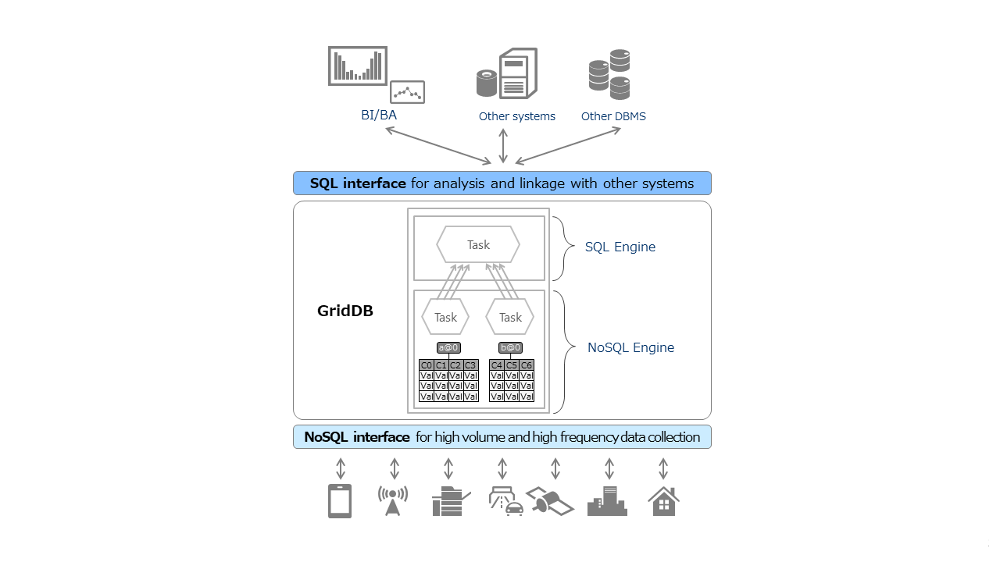

# GridDB CE v4.5

## Changelog

GridDB CE v4.5 combines NoSQL and SQL dual interface capabilities, offering high performance and an improved ease of use.

Changes in v4.5 are as follows:
1. Added SQL Interface and JDBC Driver
    - In addition to the NoSQL interface, it is now possible to access the database using SQL with the JDBC driver.
    - SQL92 compliant such as Group By and Join between different tables.
2. Added Table Partitioning functionality
   - By allocating the data of a huge table in a distributed manner, it is now possible to execute the processors in parallel and speed up access.
3. Multiple nodes clustering is changed to a single node setup.

---

| Title| Features | V4.3CE | V4.5CE |
|-------|----------|--------------------|----------------|
| Data Management   | Collection                      | ✓ | ✓ |
|                   | Timeseries container            | ✓ | ✓ |
|                   | Index                           | ✓ | ✓ |
|                   | Table Partitioning              |    | ✓ |
| Query Language    | TQL                             | ✓ | ✓ |
|                   | SQL                             | ✓ | ✓ |
| API               | NoSQL Interface (Java)          | ✓ | ✓ |
|                   | NoSQL Interface (C)             | ✓ | ✓ |
|                   | SQL Interface (JDBC)            |    | ✓ |
| Time series data  | Expiry release                  | ✓ | ✓ |
| Cluster           | Multiple nodes clustering       | ✓ |    |

---

