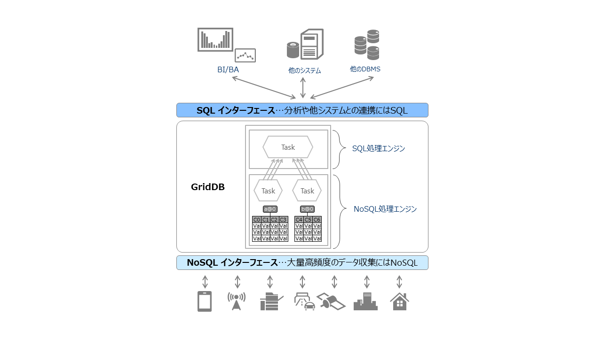

# GridDB CE 4.5

## 変更点

GridDB CE V4.5の主な変更点は以下のとおりです。

#### NoSQLとSQLのデュアルインターフェイスの提供
1. SQLインタフェース
    - 従来のNoSQLインタフェースに加え、JDBCドライバにてSQLを用いてデータベースにアクセス可能になりました。
    - Group Byや異なるテーブル間のJoinなどSQL92準拠です。
2. テーブルパーティショニング
    - データ登録数が多い巨大なテーブルのデータを分散配置することで、プロセッサの並列実行を可能とし、巨大テーブルのアクセスを高速化するための機能です。

なお、複数ノードによるクラスタ構成は1台ノードによるクラスタ構成の「シングル構成のみ」に変更しました。

---

| 項目       | 機能                | V4.3CE | V4.5CE |
|------------|--------------------------------|----------|--------|
| データ管理  | コレクション                     | ✓ | ✓ |
|            | 時系列コンテナ                    | ✓ | ✓ |
|            | 索引                              | ✓ | ✓ |
|            | テーブルパーティショニング        |    | ✓ |
| クエリ言語  | TQL                              | ✓ | ✓ |
|            | SQL                               |    | ✓ |
| API        | NoSQLインタフェース(Java)         | ✓ | ✓ |
|            | NoSQLインタフェース(C)            | ✓ | ✓ |
|            | SQLインタフェース(JDBC)           |    | ✓ |
| 時系列データ | 期限解放                        | ✓ | ✓ |
| クラスタ    | 複数ノードによるクラスタ構成     | ✓ |    |

---

