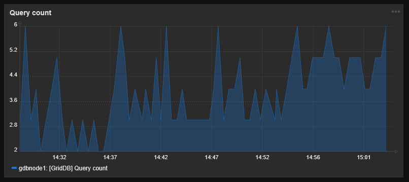
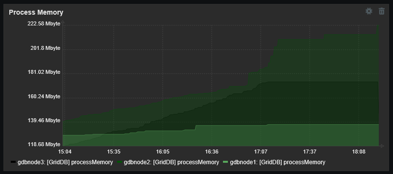
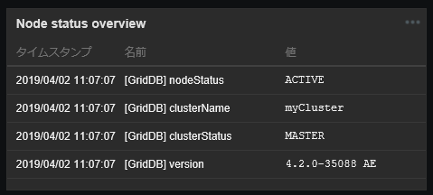
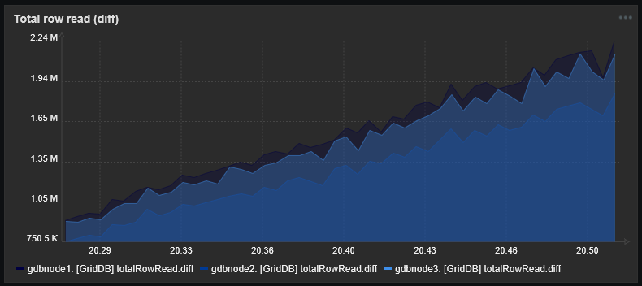
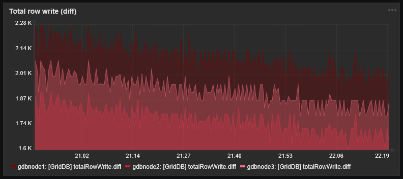
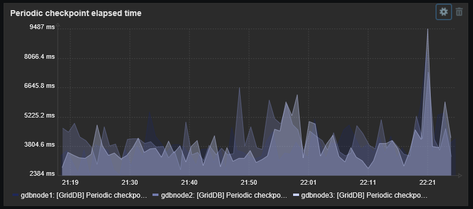
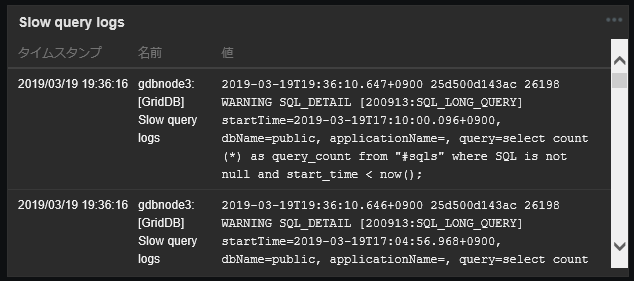
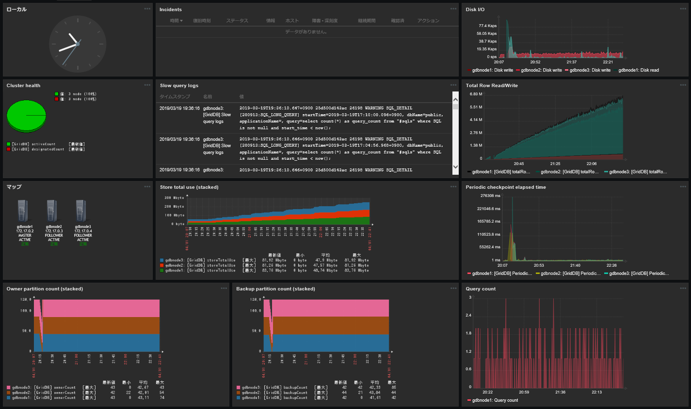
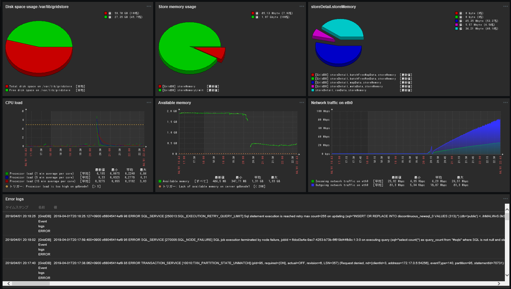

# はじめに

## 本書の目的

本書ではGridDB 監視テンプレート for Zabbixの設定方法やテンプレートを応用した監視方法について説明します。

## 注意事項

GridDB 監視テンプレート for ZabbixはGridDBの監視を支援するためのテンプレートです。
運用するシステムに合わせてカスタマイズして利用してください。

# 概要

## GridDB 監視テンプレート for Zabbixとは

GridDB 監視テンプレート for Zabbixは、ZabbixでGridDBの死活監視、リソース監視、性能監視などを行うことを支援するテンプレートです。

## ファイル構成

次のファイルで構成されます。

-   `griddb_templates.xml`
    -   Zabbix Ver 4.0/5.0用 監視テンプレート
-   `griddb_templates_v6.xml`
    -   Zabbix Ver 6.0用 監視テンプレート
-   `griddb_templates_v7.xml`
    -   Zabbix Ver 7.0用 監視テンプレート

## 動作環境

本テンプレートは以下のソフトウェアで動作確認しました。

-   Zabbix Ver.6.0/7.0
-   GridDB V5.8CE
    -   サーバ
    -   運用コマンド(gs_stat)
    -   WebAPI

また、監視対象となるGridDBノードを動作させる各サーバに、Zabbixエージェントをインストールしてください。

以降の説明では、上記ソフトウェアのインストールが完了していること、Zabbixに監視対象のサーバがホストとして登録されていることを前提にします。

\[メモ\]
-   GridDBのバージョンが上記と異なる場合、一部のアイテムが取得できない場合があります。

# インストール手順

## Zabbixエージェントの設定

本テンプレートでは、GridDBのイベントログの取得をアクティブチェックを用いて実行します。アクティブチェックを有効にするため、Zabbixエージェントの設定ファイル(デフォルトは `/etc/zabbix/zabbix_agentd.conf` )に次の設定を記述します。

|設定値|設定内容|
|-|-|
|Server|Zabbixサーバのアドレス|
|Hostname|Zabbixに設定したホスト名|
|ServerActive|Zabbixサーバのアドレス|

設定を変更したあとは、Zabbixエージェントを再起動してください。

## テンプレートのインポート

Zabbixフロントエンドにログインし、次の手順で本テンプレートをインポートしてください。

1. [設定] -> [テンプレート] -> [インポート]を選択します。
2. インポートするファイルに `griddb_templates.xml` を指定します。
3. ルールはデフォルトのまま[インポート]を選択します。

インポートに成功すると一覧に[Template GridDB]が追加されます。

## テンプレートマクロの設定

[Template GridDB] -> [マクロ]を選択し、各マクロのデフォルト値をGridDBの設定に合わせて変更します。

|マクロ名|デフォルト値|説明|
|-|-|-|
|{$GSHOME}         | `/var/lib/gridstore`     |GridDBホームディレクトリ|
|{$GSLOG}          | `/var/lib/gridstore/log` |GridDBイベントログ格納ディレクトリ|
|{$GSHOSTGROUP}    |GridDB nodes              |Zabbixのホストグループ名|
|{$GSHOSTPORT}     |10040                     |GridDBノードの運用管理操作用のポート番号|
|{$GSUSER}         |admin                     |GridDBクラスタの管理ユーザ|
|{$GSPASS}         |admin                     |GridStoreクラスタの管理ユーザパスワード|
|{$GSPARTITIONNUM} |128                       |パーティション数|
|{$GSWEBAPIURL}    | http&#58;//localhost:8081/griddb/v2/myCluster/dbs/public |GridDB WebAPIのURI|

\[メモ\]
-   各ホストに対して別々の値を設定したい場合は、各ホストのマクロを設定すると
そちらが使用されます。

## ホストへのテンプレート設定

ZabbixエージェントおよびGridDBサーバをインストールしたホストに対して本テンプレートを設定することで、監視を開始します。

次の手順で設定してください。

1. [設定] -> [ホスト]から対象ホストを選択し、ホストの設定画面を開く。
2. [テンプレート] -> [新規テンプレートをリンク]の[選択]
3. [Template GridDB]を選択し、[追加] -> [保存]

テンプレートの設定を保存すると、自動的に監視が始まります。
監視結果は[監視データ] -> [最新データ]を開いて対象ホストの欄を確認してください

# 監視内容

## アプリケーション

アプリケーションの概要は以下のとおりです。

|名前|概要|
|-|-|
|gs_stat|gs_statコマンドで取得できる性能情報のアイテム群。|
|gs_logs|GridDBのサーバログに関するアイテム群。|
|gs_aggregation|ホストグループに対して集計を行うアイテム群。|

## アイテム

アプリケーションごとのアイテムを説明します。

### gs_stat

|名前|タイプ|監視間隔|概要|
|-|-|-|-|
|[GridDB] gs_stat master|HTTPエージェント|30秒|JSON形式の性能情報をノードから取得する。 各種性能情報アイテムのマスターアイテムとして使用。|
|[GridDB] (JSON Path)|依存アイテム|-|各種性能情報のアイテム。|
|[GridDB] (JSON Path).diff|依存アイテム|-|各種性能情報のうち、累積値のアイテムの差分を計算するアイテム。|

gs_statのアイテムの内容については、GridDB機能リファレンスを参照ください。

SSL接続を有効にする場合、次の設定を行ってください。
* マクロ`{$GSHOSTPORT}`をノードの`/system/serviceSslPort`(デフォルト:10045)に
  合わせて設定する。
* アイテム`[GridDB] gs_stat master`のURLの先頭を`http://`から`https://`に変更する。

### gs_logs

|名前|タイプ|監視間隔|概要|
|-|-|-|-|
|[GridDB] Event logs         |Zabbixエージェント(アクティブ)|1秒|イベントログファイルを収集する。|
|[GridDB] Event logs INFO    |Zabbixエージェント(アクティブ)|1秒|INFOログを収集する。|
|[GridDB] Event logs WARNING |Zabbixエージェント(アクティブ)|1秒|WARNINGログを収集する。|
|[GridDB] Event logs ERROR   |Zabbixエージェント(アクティブ)|1秒|ERRORログを収集する。|
|[GridDB] Periodic checkpoint elapsed time|Zabbixエージェント(アクティブ)|10秒|ログから定期チェックポイントの実行時間を取得する。|
|[GridDB] Slow query logs|Zabbixエージェント(アクティブ)|1秒|スロークエリのログを収集する。|

### gs_aggregation

gs_aggregationのアイテムは{$GSHOSTGROUP}で指定されたホストグループに対して
集計演算を行うことで、クラスタ単位の情報を収集します。

|名前|タイプ|監視間隔|概要|
|-|-|-|-|
|[GridDB] Owner partition count  |Zabbixアグリゲート|30秒|クラスタのレプリカのうち、オーナの個数|
|[GridDB] Backup partition count |Zabbixアグリゲート|30秒|クラスタのレプリカのうち、バックアップの個数|
|[GridDB] Store total use        |Zabbixアグリゲート|30秒|クラスタの保有する全データ容量(バイト)|

## トリガー

監視項目に対するトリガーを設定し、GridDBの障害やイベントを検知・通知します。

|名前|深刻度|条件|概要|
|-|-|-|-|
|[GridDB] OWNER_LOSS partition has been detected.|重度の障害|partitionStatusがOWNER_LOSSに遷移した時|パーティション異常を通知。|
|[GridDB] ABNORMAL node has been detected.|重度の障害|nodeStatusがABNORMALに遷移した時|ノード異常を通知。|
|[GridDB] Log duplication has stopped due to some error. |軽度の障害|duplicateLogが-1になった時|自動バックアップが何らかのエラーによって停止されたことを通知。|
|[GridDB] Some error has been detected on {HOST.NAME}.|軽度の障害|文字列ERRORを含むログが検出された時|イベントログにエラー出力があったことを通知。|
|[GridDB] REPLICA_LOSS partition has been detected.|警告|partitionStatusがREPLICA_LOSSに遷移した時|パーティション状態の変化を通知。|
|[GridDB] Node has left the cluster.|警告|clusterStatusがSUB_CLUSTERに遷移した時|ノードがクラスタから離脱したことを通知。|
|[GridDB] Cluster status has become stable. |情報|activeCountが変化し、designatedCountと等しくなった時|クラスタが安定状態になったことを通知。|
|[GridDB] Total number of nodes in the cluster has decreased.|情報|designatedCountが減った時|クラスタが縮小されたことを通知。|
|[GridDB] Total number of nodes in the cluster has increased.|情報|designatedCountが増えた時|クラスタが拡張されたことを通知。|

\[メモ\]
-   深刻度が情報以外のトリガーの障害イベント生成モードは複数です。

## グラフ

複数のアイテムをまとめたカスタムグラフを提供します。スクリーンやダッシュボードに配置するために使用します。

|名前|種類|用途|
|-|-|-|
|[GridDB] Cluster health|分解円グラフ|クラスタが安定状態にあるかを確認する。マスタノードのみ表示できる。|
|[GridDB] Store memory usage|分解円グラフ|データ管理用メモリの上限に対する使用割合を把握する。|
|[GridDB] storeDetail.***|分解円グラフ|ストアの詳細情報を把握する。|
|[GridDB] Network status|ノーマル|現在のネットワーク状態を表示する。|
|[GridDB] Total read and write operation|ノーマル|データのRead/Writeの回数(累計)を表示する。|
|[GridDB] Total checkpoint and backup|ノーマル|チェックポイントとバックアップの実行回数(累計)を確認する。|
|[GridDB] memoryDetail total|積算グラフ|メモリの総確保量の内訳を把握する。|
|[GridDB] memoryDetail cached|積算グラフ|メモリのキャッシュ量の内訳を把握する。|

## スクリーン

ノードの情報に関するアイテムやグラフをまとめたスクリーンを提供します。各ホストのホストスクリーンから見ることができます。

|名前|概要|
|-|-|
|[GridDB] Node status|ノードの状態に関するアイテムやカスタムグラフを表示する。|
|[GridDB] Store details|ストアの詳細情報のカスタムグラフをまとめて表示する。|

# テンプレートの応用

本テンプレートの応用として、監視アイテムの追加方法やダッシュボードの作成方法を説明します。

## GridDB WebAPIを用いた監視アイテムの追加

GridDB WebAPIを使うと、任意のSELECT文を実行し、結果をJSON形式で取得できます。
また、SQLを用いて各種メタテーブルのデータを集計することで、GridDBクラスタの状態監視が行えます。

Zabbixでは、次のように監視アイテムを作成することで、GridDB WebAPIおよびメタテーブルを使った、GridDBクラスタの状態監視が行えます。

|アイテムタイプ|作成するアイテム|
|--|--|
| HTTPエージェント | GridDB WebAPIを介してSQL文を実行する。|
| 依存アイテム     | 上記HTTPエージェントアイテムをマスターアイテムとし、保存前処理でJSON Pathを用いてパラメータを取り出す。|

上記のアイテムを使えば、状態収集用のJDBCアプリケーションを別途用意することなく、より柔軟な監視をZabbixで行うことができます。

本テンプレートには参考例として次のアプリケーションを用意しています。

|名前|概要|
|-|-|
|gs_webapi|GridDB WebAPIを介して情報を取得するアイテム群。|

gs_webapiの各アイテムは次のとおりです。クラスタ単位の情報を保持するアイテムであるため、1つのホストに対して有効にしてください。

|名前|アイテムタイプ|説明|
|--|--|--|
|[GridDB] Query count master|HTTPエージェント|メタテーブル#sqlsのクエリの総数を集計する。|
|[GridDB] Query count       |依存アイテム    |実行中のクエリの総数。|

<figure>

<figcaption>実行中のクエリの総数</figcaption>
</figure>

## ダッシュボードの作成

ダッシュボードはテンプレートに含むことができません。そのため、本テンプレートを実際の監視システムで活用するには、ウィジェットを作成したり、テンプレートのグラフをダッシュボードに配置したりする必要があります。

また、本テンプレートに含まれるアイテムの多くは、ノード単位の情報を表すアイテムです。
クラスタ単位の情報を参照するには、ダッシュボードのウィジェットを活用します。

以降では、ウィジェットの構成例とそれを含むダッシュボードの構成例を示します。

### ウィジェットの構成例

#### プロセスメモリの推移

|||
|-|-|
|ウィジェットタイプ|グラフ|
|アイテム名|[GridDB] processMemory|
|用途|メモリ使用量の概況の把握|

<figure>

<figcaption>プロセスメモリ</figcaption>
</figure>

#### ノードステータスの概要

|||
|-|-|
|ウィジェットタイプ|プレーンテキスト|
|アイテム名|(任意のアイテム)|
|用途|ノードステータスの把握|

<figure>

<figcaption>ノードステータス</figcaption>
</figure>

#### 参照ロウ数

|||
|-|-|
|ウィジェットタイプ|グラフ|
|アイテム名|[GridDB] totalRowRead.diff|
|用途|ディスク読込み負荷の推移の把握|

<figure>

<figcaption>参照ロウ数</figcaption>
</figure>

#### 登録ロウ数

|||
|-|-|
|ウィジェットタイプ|グラフ|
|アイテム名|[GridDB] totalRowWrite.diff|
|用途|ディスク書込み負荷の推移の把握|

<figure>

<figcaption>登録ロウ数</figcaption>
</figure>

#### 定期チェックポイント実行時間

|||
|-|-|
|ウィジェットタイプ|グラフ|
|アイテム名|[GridDB] Periodic checkpoint elapsed time|
|用途|ディスク書込み負荷の推移の把握|

<figure>

<figcaption>定期チェックポイント実行時間</figcaption>
</figure>

#### スロークエリログ

|||
|-|-|
|ウィジェットタイプ|プレーンテキスト|
|アイテム名|[GridDB] Slow query logs|
|用途|スローダウン発生時の原因分析|

<figure>

<figcaption>スロークエリログ</figcaption>
</figure>

### ダッシュボードの構成例

#### クラスタ監視用

<figure>

<figcaption>ダッシュボードの構成例(クラスタ監視)</figcaption>
</figure>

クラスタ全体を監視する場合は、各ノードの情報を集約したグラフやイベントログの情報や、各ノードの負荷状況やリソースの使用状況を表示します。

また、Template OS Linuxに含まれるアイテムやZabbixエージェントのアイテムキーを利用して、本テンプレートに含まれないOSリソースの情報を並べて表示すると、ボトルネックの特定に役立ちます。

加えて、アクションログや障害情報、マップなど、Zabbixの機能を活用し、障害発生状況が一目で分かるような構成にしておくと良いでしょう。

#### ノード監視用

<figure>

<figcaption>ダッシュボードの構成例(ノード監視)</figcaption>
</figure>

クラスタ監視用のダッシュボードだけでなく、ノード監視用のダッシュボードも作成しておくことを推奨します。

ノード監視用のダッシュボードでは、ノードのイベントログ、メモリ使用量の内訳、ディスクの空き状況など、ノードに関するより詳細な情報を集約して表示します。特定のノードの負荷が高い場合やノード障害が発生した場合の原因分析に役立ちます。

各ウィジェットはダイナミックアイテムに設定しておくことで、画面右上のホスト選択によって表示するノードを切り替えることが可能になります。

# 商標

-   GridDBは日本国内における東芝デジタルソリューションズ株式会社の登録商標です。
-   ZabbixはZabbix SIAの登録商標です。
